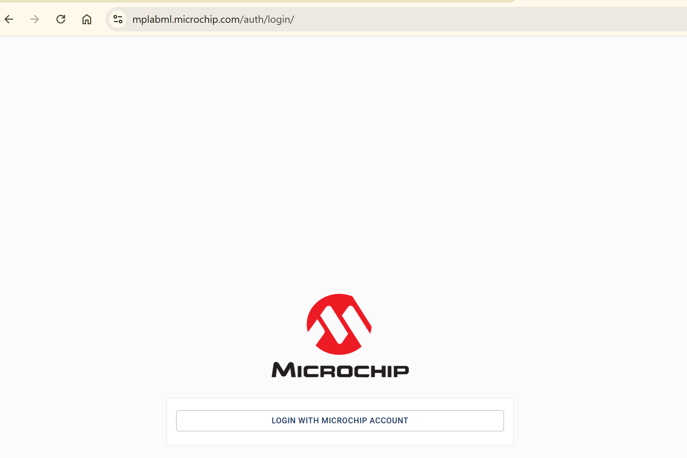
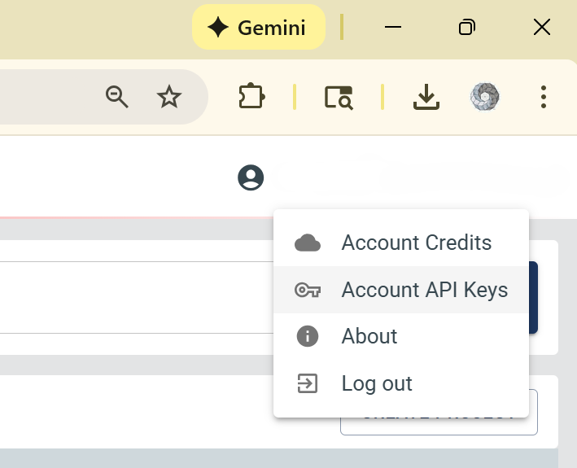
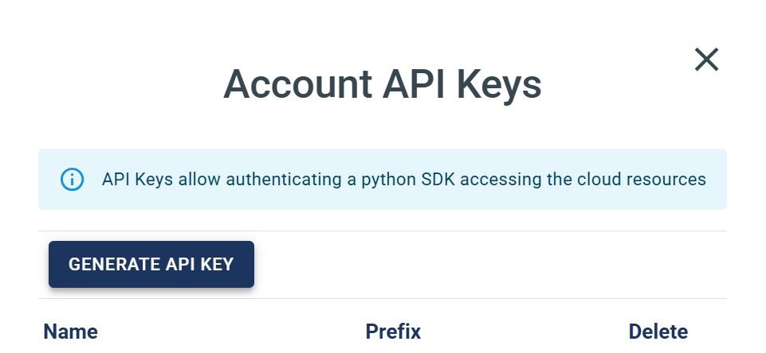
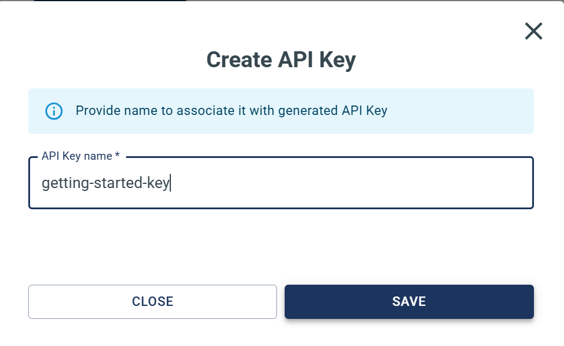
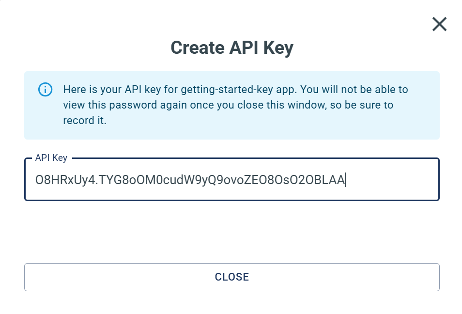

# Creating an MPLAB ML API Key

## What is an API Key?

An API key is a secure token that allows you to authenticate with MPLAB ML from external applications like Python notebooks, scripts, or automated workflows. Think of it as a password specifically for programmatic access.

**Why use an API key instead of your regular password?**
- ✅ **Security**: Keys can be revoked without changing your password
- ✅ **Automation**: Enables scripts and notebooks to run without manual login
- ✅ **Tracking**: Each key can have a unique name for identification
- ✅ **Control**: Create different keys for different projects or computers

## Creating Your API Key

### Step 1: Log into MPLAB ML

Visit [https://www.mplabml.microchip.com/auth/login/](https://www.mplabml.microchip.com/auth/login/) and sign in with your account credentials.

<p align="center">
  
</p>

---

### Step 2: Open Account API Keys

Click on your **user account icon** in the upper right corner to open the menu, then select **"Account API Keys"**.

<p align="center">
  
</p>

---

### Step 3: Generate a New Key

Click the **"GENERATE API KEY"** button to create a new key.

<p align="center">
  
</p>

---

### Step 4: Name Your Key

Give your key a **descriptive name** that helps you remember its purpose. Good examples:
- `laptop-personal-projects`
- `training-notebooks`
- `arc-fault-detection`

<p align="center">
  
</p>

---

### Step 5: Save Your Key Securely

⚠️ **IMPORTANT**: Copy and save your key immediately! You will **not** be able to view it again after closing this window.

<p align="center">
  
</p>

**Where to save it:**
- ✅ Password manager (recommended)
- ✅ Secure encrypted file
- ❌ Plain text file in your project (security risk!)
- ❌ Committed to Git repositories (never do this!)

---

## Using Your API Key

Once you have your key, you can authenticate in Python:
```python
from mplabml import Client
from getpass import getpass

# Secure input (characters hidden)
api_key = getpass("Enter your MPLAB ML API Key: ")
client = Client(api_key=api_key)

print("✓ Connected to MPLAB ML!")
```

📓 **See it in action**: Check out the [01-authentication notebook](../../notebooks/01-getting-started.ipynb) for a complete walkthrough.

---

## Best Practices

### ✅ Do:
- Create separate keys for different computers/projects
- Use descriptive names for easy identification
- Store keys in a password manager
- Revoke unused keys regularly

### ❌ Don't:
- Share keys with others (create separate keys instead)
- Commit keys to Git repositories
- Store keys in plain text files
- Reuse keys across multiple public projects

---

## Managing Your Keys

### Viewing Existing Keys
Return to **Account API Keys** to see all your active keys with:
- Key name
- Prefix for indentification purposes

### Revoking a Key
If a key is compromised or no longer needed:
1. Go to **Account API Keys**
2. Find the key to revoke
3. Click the **"Delete"** button
4. Confirm the action

Deleting a key immediately disables it - any applications using that key will lose access.

---

## Troubleshooting

**Problem**: "Authentication failed" error
- ✓ Check you copied the entire key (no spaces before/after)
- ✓ Verify the key hasn't been revoked
- ✓ Try generating a new key

**Problem**: Can't see "Account API Keys" menu option
- ✓ Ensure you're logged in
- ✓ Verify your account has API access enabled
- ✓ Contact support if the issue persists

---

## Next Steps

✅ You now have an API key!

**Continue your journey:**
1. 📓 [Authenticate in a notebook](../../notebooks/01-getting-started/01-authentication.ipynb)
2. 🔍 [Explore SDK functions](../../notebooks/01-getting-started/02-exploring-sdk-functions.ipynb)
3. 📊 [Work with your first project](../../notebooks/02-project-management/01-list-and-view-projects.ipynb)

---

